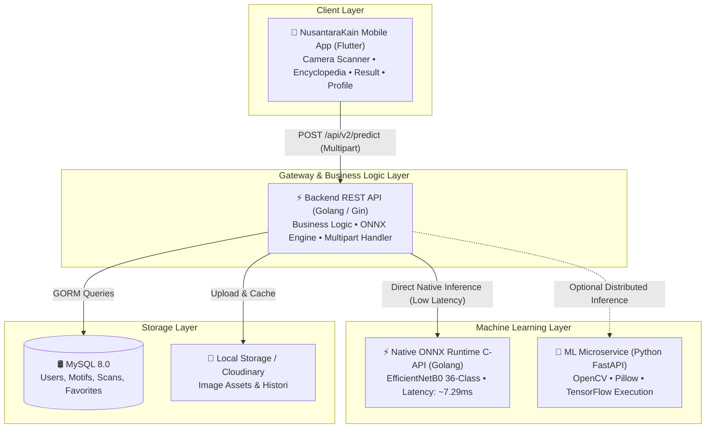

<div align="center">

# 🌿 NusantaraKain — Intelligent Batik Recognition Platform
### *Kenali. Lestarikan. Banggakan.*

[](https://github.com/zakverse/Batik-AI-/actions/workflows/ci.yml)
[](https://go.dev/)
[](https://flutter.dev/)
[](https://onnxruntime.ai/)
[](https://www.tensorflow.org/)
[](https://www.python.org/)
[](https://fastapi.tiangolo.com/)
[](https://www.docker.com/)
[](LICENSE)

<br/>

<p align="center">
  <b>NusantaraKain</b> adalah platform <i>end-to-end</i> berbasis <b>Deep Learning Vision</b> yang mengklasifikasikan <b>35 motif batik tradisional Nusantara + 1 kelas Non-Batik</b> secara <i>real-time</i> dengan akurasi tinggi dan latensi rendah.
</p>

---

### 🌟 Key Performance Highlights

| 🎯 Test Accuracy | 📊 Macro F1-Score | 🏆 Non-Batik F1 | ⚡ Inference Latency | 🏛️ Dataset Classes |
| :---: | :---: | :---: | :---: | :---: |
| **86.48%** | **0.8707** | **1.0000** | **~7.29 ms** *(ONNX)* | **36 Kelas (35 Batik + 1 Non-Batik)** |

</div>

---

## 📑 Daftar Isi

- [✨ Tentang Proyek](#-tentang-proyek)
- [🏛️ Cakupan 36 Kelas Klasifikasi](#️-cakupan-36-kelas-klasifikasi)
- [🏗️ Arsitektur Sistem](#️-arsitektur-sistem)
- [📂 Struktur Monorepo](#-struktur-monorepo)
- [🔬 Pipeline Machine Learning & Benchmarking](#-pipeline-machine-learning--benchmarking)
  - [1. Progres Model](#1-progres-model)
  - [2. Benchmark Latensi: Keras vs ONNX Runtime](#2-benchmark-latensi-keras-vs-onnx-runtime)
  - [3. Roadmap Notebooks](#3-roadmap-notebooks)
- [📱 Mobile App — NusantaraKain](#-mobile-app--nusantarakain)
- [🛠️ Tech Stack](#️-tech-stack)
- [🚀 Panduan Memulai (Quick Start)](#-panduan-memulai-quick-start)
  - [Opsi 1: Menjalankan via Docker Compose (Rekomendasi)](#opsi-1-menjalankan-via-docker-compose-rekomendasi)
  - [Opsi 2: Menjalankan Secara Lokal (Per Service)](#opsi-2-menjalankan-secara-lokal-per-service)
- [📡 Dokumentasi API](#-dokumentasi-api)
- [⚙️ Variabel Lingkungan (Environment Variables)](#️-variabel-lingkungan-environment-variables)
- [📜 Lisensi & Kontribusi](#-lisensi--kontribusi)

---

## ✨ Tentang Proyek

Batik Indonesia adalah warisan budaya dunia takbenda (*Masterpiece of Oral and Intangible Heritage of Humanity*) yang diakui oleh UNESCO. Setiap motif batik mengandung nilai filosofis, sejarah, dan identitas daerah yang kaya. Namun, mengenali variasi motif batik Nusantara yang sangat beragam secara kasat mata sering kali menjadi tantangan bagi masyarakat luas.

**NusantaraKain** hadir sebagai gerakan digital untuk melestarikan wastra Nusantara melalui teknologi kecerdasan buatan (AI). Kami percaya bahwa kain batik bukan sekadar pakaian, tetapi warisan budaya adiluhung, identitas bangsa, dan cerita yang hidup.

Platform ini memadukan:
1. **Computer Vision Mutakhir**: Arsitektur *EfficientNetB0* yang di-fine-tune untuk mengenali karakteristik visual 35 motif batik + deteksi Non-Batik.
2. **High-Performance Inference**: Konversi model ke *ONNX Runtime* dengan backend Golang, latensi **~7.29 ms** per inferensi.
3. **Mobile App Production-Ready**: Aplikasi Flutter NusantaraKain dengan live camera scanner, ensiklopedia motif, dan edukasi budaya.
4. **Clean Microservices Architecture**: Pemisahan rapi antara mobile Flutter, API gateway Golang, dan pipeline ML terisolasi.

---

## 🏛️ Cakupan 36 Kelas Klasifikasi

NusantaraKain dilatih untuk mengenali **35 motif batik** dari berbagai penjuru Indonesia, ditambah **1 kelas Non-Batik** untuk deteksi citra yang bukan batik:

<details>
<summary><b>🔍 Klik untuk melihat daftar lengkap 36 kelas berdasarkan daerah asal</b></summary>
<br/>

| Wilayah Asal | Nama Motif Batik |
|---|---|
| **Sumatera** | `Aceh_Pintu_Aceh`, `Sumatera_Barat_Rumah_Minang`, `Sumatera_Utara_Boraspati`, `Lampung_Gajah` |
| **DKI Jakarta & Jawa Barat** | `DKI_Ondel_Ondel`, `batik-betawi`, `batik-ciamis`, `batik-garutan`, `batik-priangan`, `batik-megamendung` |
| **Jawa Tengah & D.I. Yogyakarta** | `batik-parang`, `batik-kawung`, `batik-ceplok`, `batik-keraton`, `batik-pekalongan`, `batik-lasem`, `batik-sekar`, `batik-sidoluhur`, `batik-sidomukti`, `batik-sogan`, `batik-tambal`, `batik-celup` |
| **Jawa Timur & Madura** | `Jawa_Timur_Pring`, `batik-gentongan`, `Madura_Mataketeran` |
| **Bali & Nusa Tenggara** | `Bali_Barong`, `batik-bali`, `NTB_Lumbung` |
| **Kalimantan & Sulawesi** | `Kalimantan_Dayak`, `Sulawesi_Selatan_Lontara` |
| **Maluku & Papua** | `Maluku_Pala`, `Papua_Asmat`, `Papua_Cendrawasih`, `Papua_Tifa`, `batik-cendrawasih` |
| **Non-Batik** | `Non-Batik` *(deteksi citra yang bukan kain batik)* |

</details>

---

## 🏗️ Arsitektur Sistem

NusantaraKain dibangun dengan prinsip **Separation of Concerns (SoC)** dan **Clean Architecture**:



---

## 📂 Struktur Monorepo

```
Batik-AI/
├── apps/
│   ├── backend/               # REST API Gateway (Golang - Clean Architecture + Native ONNX)
│   │   ├── cmd/server/        # Entrypoint server Golang
│   │   ├── internal/          # Domain, Handlers, Services, Repositories, Inference
│   │   └── model/             # Artifacts: efficientnetb0_finetuned.onnx, onnxruntime.dll
│   ├── ml-service/            # Python FastAPI Microservice (TensorFlow / Keras runtime)
│   │   ├── app/               # API routes, inference pipeline, schemas
│   │   └── requirements.txt   # Dependensi Python
│   └── mobile/                # NusantaraKain Mobile App (Flutter 3.x)
│       ├── lib/               # Screens, Widgets, Services, Core Theme & Data
│       └── pubspec.yaml       # Dependensi Flutter
├── training/                  # ML Training Pipeline, Research & Experiments
│   ├── notebooks/             # 11 Jupyter Notebooks terstruktur (00 s/d 10)
│   └── saved_models/          # Model checkpoints (.keras, .onnx)
├── datasets/                  # Manajemen Dataset Batik (Raw & Processed)
├── models/                    # Model Artifacts (Baseline, EfficientNet, Fine-Tuned ONNX)
├── results/                   # Grafik Evaluasi, Confusion Matrix, CSV Benchmark
├── docs/                      # Dokumentasi Arsitektur & API Contract
├── deployment/                # Konfigurasi Docker & Infrastruktur
├── docker-compose.yml         # Orkestrasi Multi-Container (Backend, ML, MySQL, PMA)
└── Makefile                   # Perintah otomatisasi project
```

---

## 🔬 Pipeline Machine Learning & Benchmarking

### 1. Progres Model

Evolusi model Deep Learning yang dikembangkan dalam riset NusantaraKain:

| Model | Arsitektur | Total Parameter | Test Accuracy | Macro F1 | Generalization Gap | Status |
|---|---|---|:---:|:---:|:---:|:---:|
| **Baseline CNN** | 4-Block Custom CNN (Scratch) | 427,299 | 3.31% | 0.025 | Underfitting | Baseline |
| **EfficientNetB0 (Frozen)** | ImageNet Pretrained (Transfer Learning) | 4,099,526 | 69.96% | 0.698 | +4.12 pp | Baseline TL |
| **EfficientNetB0 (Fine-Tuned)** | Top 25 Layers Unfrozen + Low LR | 4,099,526 | **86.48%** | **0.8707** | **-0.58 pp** | 🏆 **Production Model** |

> [!TIP]
> Model **EfficientNetB0 Fine-Tuned** menghasilkan **Generalization Gap negatif (-0.58 pp)**, membuktikan bahwa model tidak mengalami *overfitting* dan memiliki kemampuan generalisasi yang sangat stabil pada unseen test data. Non-Batik F1-Score mencapai **1.0000** (presisi sempurna).

---

### 2. Benchmark Latensi: Keras vs ONNX Runtime

Pengujian inferensi CPU pada 200 sampel citra uji:

```
TensorFlow Keras (CPU) : ▇▇▇▇▇▇▇▇▇▇▇▇▇▇▇▇▇▇▇▇ 64.80 ms  (15.4 FPS)
ONNX Runtime (CPU)     : ▇ ~7.29 ms                      (~137 FPS)  [~9x FASTER 🚀]
```

| Runtime Engine | Rata-Rata Latensi | Throughput (FPS) | Akselerasi |
|---|:---:|:---:|:---:|
| **TensorFlow / Keras** | 64.80 ms | 15.43 FPS | Baseline (1.0x) |
| **ONNX Runtime Engine** | **~7.29 ms** | **~137 FPS** | **~9x Lebih Cepat** ⚡ |

---

### 3. Roadmap Notebooks

Seluruh tahapan eksperimen didokumentasikan dalam folder [`training/notebooks/`](training/notebooks/):

| Notebook | Judul & Deskripsi |
|---|---|
| [`00_dataset_audit.ipynb`](training/notebooks/00_dataset_audit.ipynb) | Verifikasi integritas data, validasi format berkas, deteksi corrupt files |
| [`01_eda.ipynb`](training/notebooks/01_eda.ipynb) | Exploratory Data Analysis, distribusi kelas motif, aspek rasio, visualisasi citra |
| [`02_preprocessing.ipynb`](training/notebooks/02_preprocessing.ipynb) | Pipeline resize (224×224), augmentasi visual, dan pembagian dataset (Train/Val/Test) |
| [`03_baseline.ipynb`](training/notebooks/03_baseline.ipynb) | Pembuatan dan pelatihan model 4-Block Convolutional Neural Network dari awal |
| [`04_efficientnet.ipynb`](training/notebooks/04_efficientnet.ipynb) | Transfer Learning EfficientNetB0 dengan bobot ImageNet (Feature Extractor) |
| [`05_evaluation.ipynb`](training/notebooks/05_evaluation.ipynb) | Evaluasi komparasi Baseline vs EfficientNetB0 (Classification Report & Matrix) |
| [`06_finetuning.ipynb`](training/notebooks/06_finetuning.ipynb) | Fine-tuning parsial (unfreezing top layers) dengan low learning rate & Adam optimizer |
| [`07_final_evaluation.ipynb`](training/notebooks/07_final_evaluation.ipynb) | Evaluasi mendalam model fine-tuned pada unseen test dataset (Akurasi 86.48%) |
| [`08_final_analysis.ipynb`](training/notebooks/08_final_analysis.ipynb) | Analisis per-kelas, deteksi *high-confidence errors*, dan evaluasi *support vs recall* |
| [`09_inference_export.ipynb`](training/notebooks/09_inference_export.ipynb) | Export pipeline inferensi end-to-end, metadata mapping, dan validasi visual |
| [`10_model_conversion.ipynb`](training/notebooks/10_model_conversion.ipynb) | Konversi model Keras `.keras` ke format `.onnx` dan benchmark komparasi latensi |

---

## 📱 Mobile App — NusantaraKain

Aplikasi mobile **NusantaraKain** dibangun dengan Flutter dan tersedia di [`apps/mobile/`](apps/mobile/).

### Fitur Utama

| Fitur | Deskripsi |
|---|---|
| 📷 **Live Camera Scanner** | Viewfinder real-time dengan golden scan bracket, torch, flip camera, dan gallery picker |
| 🤖 **AI Classification** | Klasifikasi 36 kelas via POST `/api/v2/predict` ke backend Go + ONNX Runtime |
| 📊 **Hasil Analisis** | Top-1 motif terdeteksi, confidence bar, Top-3 AI ranking, badge autentikasi |
| 📚 **Edukasi Budaya** | Tab Filosofi / Sejarah / Karakteristik untuk setiap motif yang terdeteksi |
| 🗺️ **Ensiklopedia Motif** | Jelajahi 35 ragam hias dengan filter wilayah (Jawa, Sumatera, Bali, Kalimantan, dll) |
| 🏠 **Heritage Dashboard** | Motif Hari Ini, Quick Action, Kategori Wilayah, Motif Populer |
| 👤 **Profil Pengguna** | Edit profil, statistik koleksi, panduan pindai, bantuan |

### Navigasi

```
┌──────────────────────────────────────┐
│  Beranda        ◉ SCAN        Profil │
└──────────────────────────────────────┘
```

- **Beranda**: Heritage dashboard dengan hero card & motif populer
- **SCAN FAB** (tengah): Live camera scanner → AI inference → Hasil analisis
- **Profil**: User card, statistik, menu ensiklopedia & info aplikasi
- **Ensiklopedia**: Diakses via Beranda → *Eksplor Motif* atau Profil → *Ensiklopedia Motif*

---

## 🛠️ Tech Stack

<div align="center">

| Kategori | Teknologi yang Digunakan |
|---|---|
| **Mobile App** | Flutter 3.x, Dart, Material 3, Camera, Image Picker |
| **Backend & Gateway** | Golang (Go 1.22+ / 1.25), Gin Web Framework, ONNX Runtime Go |
| **Machine Learning** | Python 3.10+, TensorFlow 2.16+, Keras, ONNX Runtime, OpenCV, Scikit-Learn |
| **Database & Cache** | MySQL 8.0, phpMyAdmin |
| **DevOps & Tooling** | Docker, Docker Compose, GitHub Actions (CI), Makefile |

</div>

---

## 🚀 Panduan Memulai (Quick Start)

### Prasyarat
- [Git](https://git-scm.com/)
- [Docker & Docker Desktop](https://www.docker.com/) (untuk deployment kontainer)
- *Atau*: Go `>=1.22`, Python `>=3.10`, Flutter `>=3.2` (untuk pengembangan lokal)

---

### Opsi 1: Menjalankan via Docker Compose (Rekomendasi)

Jalankan seluruh ekosistem backend, ML service, MySQL, dan phpMyAdmin hanya dengan satu perintah:

```bash
# 1. Clone repositori ini
git clone https://github.com/zakverse/Batik-AI-.git
cd Batik-AI-

# 2. Jalankan semua container
docker-compose up --build -d

# 3. Periksa status container
docker-compose ps
```

Layanan yang akan aktif:
- ⚡ **Backend API**: `http://localhost:8080`
- 🐍 **ML Service**: `http://localhost:8000`
- 🛢️ **MySQL Database**: `localhost:3306`
- 💻 **phpMyAdmin**: `http://localhost:8081`

---

### Opsi 2: Menjalankan Secara Lokal (Per Service)

<details>
<summary><b>1. Menjalankan Backend Golang (Native ONNX)</b></summary>
<br/>

```bash
cd apps/backend

# Download dependensi Go
go mod download

# Menjalankan HTTP REST Server
go run ./cmd/server
```
*Server aktif di: `http://localhost:8080`*
</details>

<details>
<summary><b>2. Menjalankan ML Service Python (FastAPI)</b></summary>
<br/>

```bash
cd apps/ml-service

# Buat virtual environment & aktifkan
python -m venv .venv
source .venv/bin/activate  # Linux / macOS
# .venv\Scripts\activate  # Windows

# Install dependensi
pip install -r requirements.txt

# Jalankan server FastAPI
uvicorn app.main:app --host 0.0.0.0 --port 8000 --reload
```
*Swagger UI docs aktif di: `http://localhost:8000/docs`*
</details>

<details>
<summary><b>3. Menjalankan Mobile App NusantaraKain (Flutter)</b></summary>
<br/>

```bash
cd apps/mobile

# Ambil paket Flutter
flutter pub get

# Pastikan ADB reverse untuk koneksi ke backend lokal
adb reverse tcp:8080 tcp:8080

# Jalankan aplikasi (pada emulator atau device fisik)
flutter run
```

> [!NOTE]
> Aplikasi menggunakan `http://127.0.0.1:8080` sebagai base URL backend. Jalankan `adb reverse tcp:8080 tcp:8080` agar device fisik dapat terhubung ke server lokal.
</details>

---

## 📡 Dokumentasi API

### 1. Health Check
Memeriksa status kesiapan server dan model.

- **Endpoint**: `GET /health`
- **Contoh Request**:
  ```bash
  curl http://localhost:8080/health
  ```
- **Response (`200 OK`)**:
  ```json
  {
    "status": "ok",
    "model": "EfficientNetB0 Fine-Tuned",
    "classes": 36,
    "version": "2.0.0",
    "test_accuracy": "86.48%",
    "macro_f1": "0.8707"
  }
  ```

---

### 2. Klasifikasi Citra Motif Batik (Inference)
Mengunggah citra batik untuk dianalisis oleh model Deep Learning.

- **Endpoint**: `POST /api/v2/predict`
- **Content-Type**: `multipart/form-data`
- **Parameters**:
  - `image` *(File, Required)*: Berkas citra (JPEG/PNG/WebP), max 10 MB
- **Contoh Request**:
  ```bash
  curl -X POST "http://localhost:8080/api/v2/predict" \
    -F "image=@sample_megamendung.jpg"
  ```
- **Response (`200 OK`)**:
  ```json
  {
    "success": true,
    "prediction": {
      "class": "batik-megamendung",
      "confidence": 0.9421,
      "is_batik": true
    },
    "top_predictions": [
      { "class": "batik-megamendung", "confidence": 0.9421, "is_batik": true },
      { "class": "batik-ciamis",      "confidence": 0.0312, "is_batik": true },
      { "class": "batik-garutan",     "confidence": 0.0125, "is_batik": true }
    ],
    "inference_ms": 7.29
  }
  ```

---

### 3. Benchmark Throughput & Latensi
Menguji performa waktu inferensi server secara berkala.

- **Endpoint**: `POST /api/v1/benchmark?iterations=50`
- **Contoh Request**:
  ```bash
  curl -X POST "http://localhost:8080/api/v1/benchmark?iterations=50" \
    -F "image=@sample_megamendung.jpg"
  ```
- **Response (`200 OK`)**:
  ```json
  {
    "success": true,
    "samples_count": 50,
    "total_time_ms": 364.5,
    "avg_latency_ms": 7.29,
    "throughput_fps": 137.2,
    "sample_predicted_class": "batik-megamendung",
    "sample_confidence": 0.9421
  }
  ```

---

## ⚙️ Variabel Lingkungan (Environment Variables)

Variabel lingkungan dapat disesuaikan pada file `.env` di masing-masing service:

| Service | Variabel | Nilai Default | Keterangan |
|---|---|---|---|
| **Backend** | `PORT` | `8080` | Port HTTP Server Golang |
| **Backend** | `MODEL_PATH` | `model/efficientnetb0_finetuned.onnx` | Path ke model ONNX |
| **Backend** | `CLASS_MAPPING_PATH` | `model/efficientnetb0_class_mapping.json` | Path ke JSON mapping 36 kelas |
| **Backend** | `ONNX_RUNTIME_PATH` | `model/onnxruntime.dll` | Path ke DLL/SO ONNX Runtime |
| **Backend** | `MAX_UPLOAD_SIZE_MB` | `10` | Batas maksimum ukuran berkas upload |
| **ML-Service** | `PORT` | `8000` | Port HTTP Server FastAPI |
| **ML-Service** | `MODEL_PATH` | `model/best_model.keras` | Path ke model Keras TensorFlow |

---

## 📜 Lisensi & Kontribusi

Proyek ini dirilis di bawah lisensi [MIT License](LICENSE). Kontribusi dalam bentuk *pull request*, pelaporan *issue*, ataupun saran pengembangan sangat kami apresiasi!

<div align="center">
  <sub>Dibangun dengan ❤️ untuk melestarikan dan mendigitalkan warisan budaya batik Indonesia.</sub>
  <br/><br/>
  <i>"Dari Kain, untuk Cerita yang Abadi."</i>
  <br/>
  <b>NusantaraKain v2.0.0</b>
</div>
