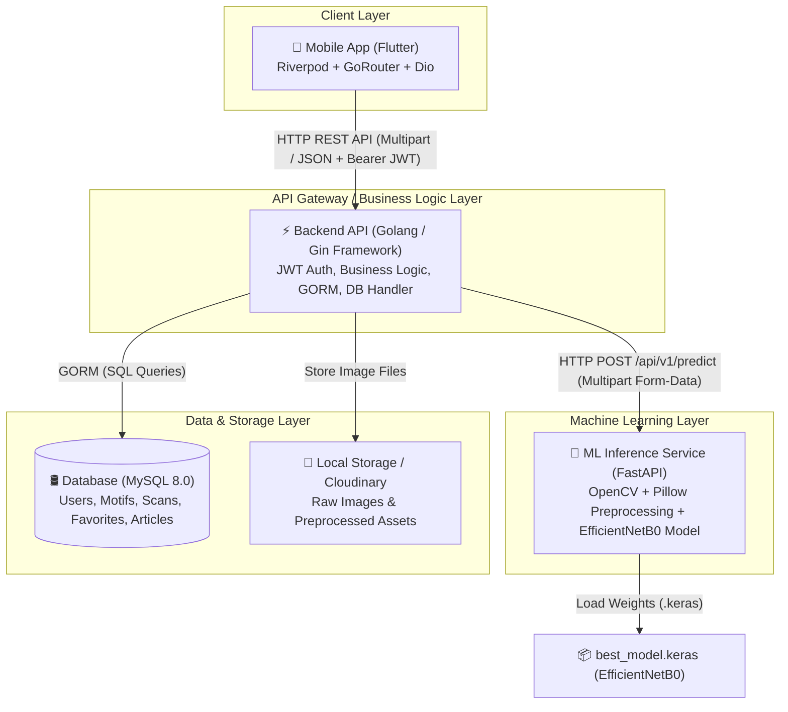
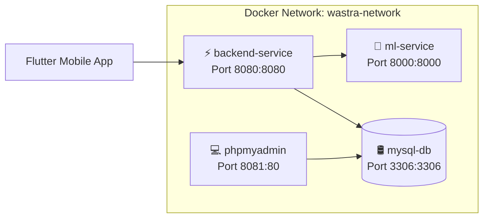
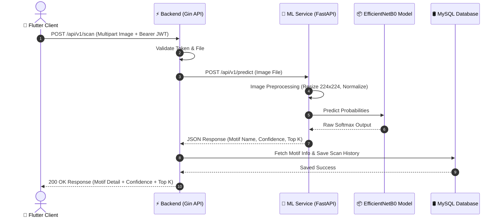
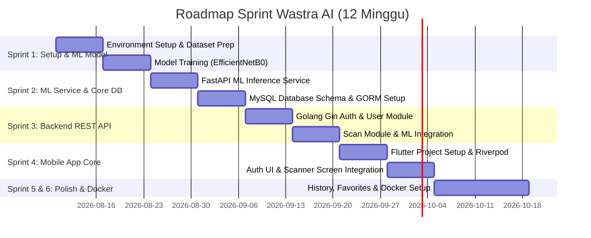

# Wastra AI - Software Architecture & System Design Document

Dokumen ini berisi spesifikasi arsitektur sistem end-to-end untuk **Wastra AI**, sebuah platform pengenalan motif batik berbasis Deep Learning dengan arsitektur microservices modern.

---

## Executive Summary & Design Principles

Wastra AI dirancang dengan prinsip-prinsip industri:
- **Separation of Concerns (SoC)**: Flutter hanya berhubungan dengan Backend Golang, Golang mengelola bisnis logik & persistence, FastAPI mengisolasi inferensi Deep Learning (TensorFlow/EfficientNetB0).
- **Clean Architecture & Scalability**: Layer terisolasi (Controller -> Service -> Repository / API -> Service -> Model).
- **Production Readiness**: Containerized via Docker Compose, API contract-driven, stateless ML service, JWT auth & refresh token pattern.

---

## 1. High-Level Architecture Diagram

Berikut adalah gambaran arsitektur sistem microservices Wastra AI:



---

## 2. Complete Folder Structure

```
wastra-ai/
├── mobile/
│   └── flutter_project/
│       ├── android/
│       ├── ios/
│       ├── assets/
│       │   ├── icons/
│       │   ├── images/
│       │   └── fonts/
│       ├── lib/
│       │   ├── core/
│       │   │   ├── constants/
│       │   │   ├── network/
│       │   │   ├── utils/
│       │   │   └── widgets/
│       │   ├── features/
│       │   │   ├── auth/
│       │   │   ├── home/
│       │   │   ├── scanner/
│       │   │   ├── history/
│       │   │   ├── favorite/
│       │   │   ├── motif_detail/
│       │   │   ├── article/
│       │   │   └── profile/
│       │   ├── router/
│       │   └── main.dart
│       └── pubspec.yaml
│
├── backend/
│   ├── cmd/api/main.go
│   ├── config/
│   ├── controllers/
│   ├── middleware/
│   ├── services/
│   ├── repositories/
│   ├── models/
│   ├── dto/
│   ├── utils/
│   ├── database/
│   ├── go.mod
│   └── Dockerfile
│
├── ml-service/
│   ├── app/
│   │   ├── api/
│   │   ├── core/
│   │   ├── models/
│   │   ├── services/
│   │   └── utils/
│   ├── model/
│   │   └── best_model.keras
│   ├── requirements.txt
│   ├── Dockerfile
│   └── main.py
│
├── training/
│   ├── notebooks/
│   │   ├── 01_eda.ipynb
│   │   ├── 02_preprocessing.ipynb
│   │   ├── 03_training.ipynb
│   │   └── 04_evaluation.ipynb
│   ├── dataset/
│   └── saved_models/
│
├── docs/
│   ├── architecture.md
│   └── api_documentation.md
│
├── docker/
│   └── nginx/
│
├── docker-compose.yml
└── README.md
```

---

## 3. Service Dependencies

### A. Mobile (Flutter) - `pubspec.yaml`
- `flutter_riverpod: ^2.5.1` & `hooks_riverpod: ^2.5.1` (State Management)
- `go_router: ^13.2.0` (Routing)
- `dio: ^5.4.3+1` & `pretty_dio_logger: ^1.3.1` (HTTP Client & Interceptor)
- `flutter_secure_storage: ^9.0.0` (Secure Token Storage)
- `image_picker: ^1.1.1` & `cached_network_image: ^3.3.1` (Image Upload & Cache)

### B. Backend (Golang) - `go.mod`
- `github.com/gin-gonic/gin v1.9.1` (Web Framework)
- `gorm.io/gorm v1.25.10` & `gorm.io/driver/mysql v1.5.6` (ORM & Driver)
- `github.com/golang-jwt/jwt/v5 v5.2.1` (JWT Token Handling)
- `golang.org/x/crypto v0.23.0` (Bcrypt Password Hashing)
- `github.com/spf13/viper v1.18.2` (Config Loader)

### C. ML Service (Python) - `requirements.txt`
- `fastapi==0.111.0` & `uvicorn[standard]==0.29.0` (Web Framework & Server)
- `tensorflow==2.16.1` (EfficientNetB0 Execution Engine)
- `opencv-python-headless==4.9.0.80`, `Pillow==10.3.0`, `numpy==1.26.4` (Image Preprocessing)

---

## 4. Docker Architecture



---

## 5. API Communication & Specification

### Endpoints Summary

| Service | Method | Endpoint | Description | Auth |
|---|---|---|---|---|
| Backend | `POST` | `/api/v1/auth/register` | User Registration | No |
| Backend | `POST` | `/api/v1/auth/login` | User Login -> Access & Refresh Token | No |
| Backend | `POST` | `/api/v1/scan` | Upload Image -> Call ML Service -> Save History | Bearer JWT |
| Backend | `GET` | `/api/v1/scan/history` | User Scan History | Bearer JWT |
| Backend | `GET` | `/api/v1/motifs` | List Batik Motifs | No |
| ML Service | `POST` | `/api/v1/predict` | Image -> Motif & Confidence Prediction | Internal Only |

---

## 6. Database Entity-Relationship Diagram (ERD)

```mermaid
erdiagram
    ROLES ||--o{ USERS : "assigned to"
    USERS ||--o{ SCAN_HISTORIES : "performs"
    USERS ||--o{ FAVORITES : "marks"
    MOTIFS ||--o{ SCAN_HISTORIES : "identified in"
    MOTIFS ||--o{ FAVORITES : "favorited in"
    ARTICLE_CATEGORIES ||--o{ ARTICLES : "categorizes"
    USERS ||--o{ ARTICLES : "authors"

    USERS {
        uint id PK
        string name
        string email UK
        string password_hash
        uint role_id FK
        datetime created_at
    }

    MOTIFS {
        uint id PK
        string name UK
        string origin
        text description
        text philosophy
    }

    SCAN_HISTORIES {
        string id PK "UUID"
        uint user_id FK
        uint motif_id FK
        float confidence
        string image_path
        json top_k_json
        datetime created_at
    }
```

---

## 7. Sequence Diagram (Image Scan & Prediction)



---

## 8. Clean Architecture Diagram

```mermaid
graph TD
    subgraph Backend Clean Architecture (Golang)
        Controller["🎮 Controller Layer"]
        Service["⚙️ Service Layer"]
        Repository["🛢️ Repository Layer"]
        Models["📦 Models & DTO Layer"]

        Controller --> Service
        Service --> Repository
        Repository --> Models
    end

    subgraph ML Service Architecture (FastAPI)
        API["📡 API Route Layer"]
        MLServiceLayer["⚙️ ML Service Layer"]
        TFModel["📦 TF Model Layer"]

        API --> MLServiceLayer
        MLServiceLayer --> TFModel
    end
```

---

## 9. Development Sprint Roadmap


